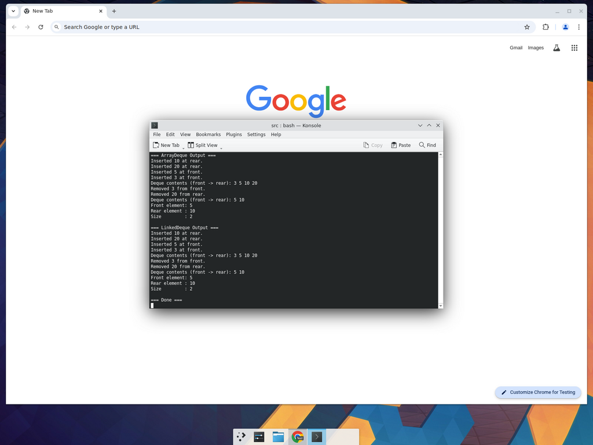
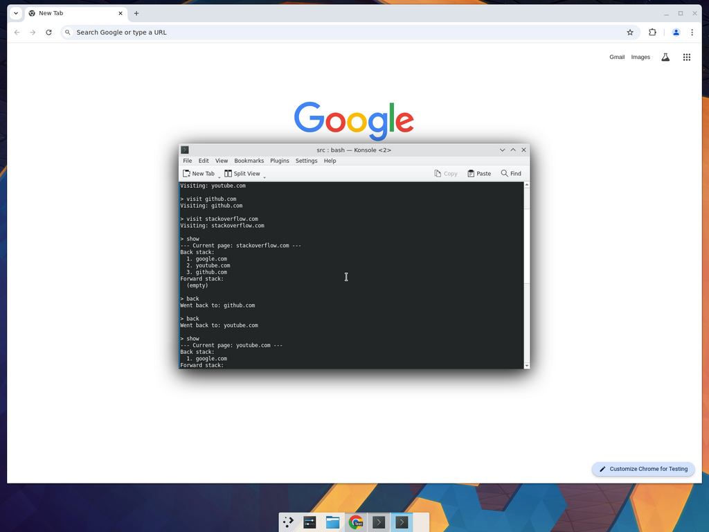
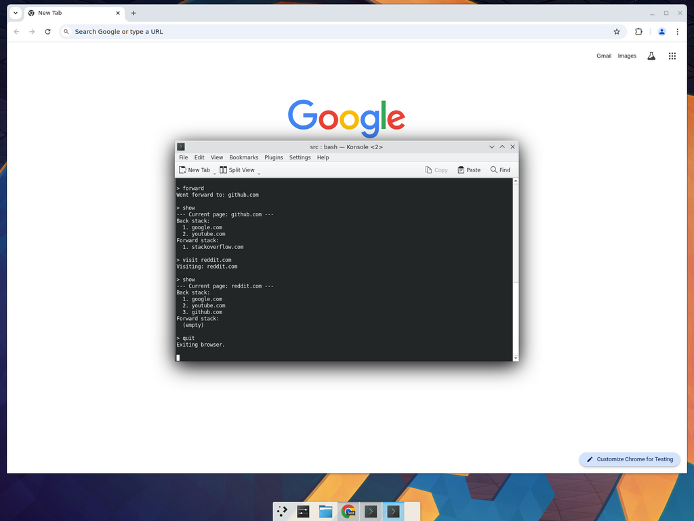

# Assignment 02 - Double-Ended Queue (Deque)

**Course:** COSC 21063 / BECS 21223 / COST 44233 / COST 44303  
**Module:** Data Structures and Algorithms  
**University of Kelaniya - Department of Statistics & Computer Science**  
**Academic Year:** 2024/2025

---

## 1. Introduction to Deque

### 1.1 What is a Deque?

A Deque (pronounced "deck") stands for Double-Ended Queue. It is a linear data structure that allows insertion and deletion of elements from both the front end and the rear end. So unlike a regular queue where you can only add at one end and remove from the other, a deque lets you do both operations at either end.

I think of it like a line of people where someone can join or leave from either side - the front or the back. That probably doesn't happen in real life (people would get annoyed), but it is the idea behind this data structure.

### 1.2 How a Deque differs from a Stack and a Queue

**Deque vs Stack:**

A stack follows the LIFO (Last In, First Out) principle. You can only push and pop elements from one end - the top. A deque is more flexible because you can add or remove elements from both the front and the rear. A stack is basically a restricted version of a deque. If you only use one end of a deque, it behaves exactly like a stack.

From Lecture 2 we learned that a stack has two main operations - push (adds to top) and pop (removes from top). Both happen at the same end. A deque has four main operations instead of two, since each operation can happen at either end.

**Deque vs Queue:**

A queue follows the FIFO (First In, First Out) principle. As covered in Lecture 3, in a queue values are added at the rear and removed from the front. A deque removes this restriction and allows additions and removals at both ends. So a queue is also a restricted version of a deque - if you only insert at the rear and remove from the front, you get a regular queue.

Here is a quick summary:

| Feature | Stack | Queue | Deque |
|---------|-------|-------|-------|
| Insertion | Top only | Rear only | Front and Rear |
| Deletion | Top only | Front only | Front and Rear |
| Principle | LIFO | FIFO | Both LIFO and FIFO |
| Ends used | 1 | 2 (but restricted) | 2 (unrestricted) |

### 1.3 Basic Operations of a Deque

The main operations you can do on a deque:

- **insertFront(x):** Insert element x at the front of the deque
- **insertRear(x):** Insert element x at the rear of the deque
- **removeFront():** Remove and return the element at the front
- **removeRear():** Remove and return the element at the rear
- **peekFront():** Look at the front element without removing it
- **peekRear():** Look at the rear element without removing it
- **isEmpty():** Check if the deque has no elements
- **isFull():** Check if the deque is full (for array-based implementation)
- **size():** Return how many elements are currently in the deque

---

## 2. Types of Deque

There are two main types of deques:

### 2.1 Input-Restricted Deque

In this type, insertion is restricted to only one end (say the rear), but deletion can be done from both ends. So you can only add items from the back, but you can remove them from either the front or the back. This is useful when you want to control where new data enters but still need flexibility in removal.

### 2.2 Output-Restricted Deque

This is the opposite - deletion is restricted to only one end (say the front), but insertion can happen at both ends. You can add items from either the front or the back, but you can only take them out from the front. This is handy when multiple sources feed data in, but processing always happens in one direction.

There is also the general deque (unrestricted) where both insertion and deletion can happen at both ends, which is the type we implement in this assignment.

---

## 3. Contiguous Implementation (Array-Based)

For the array-based deque, I used a circular array approach, similar to what we learned for circular queues in Lecture 3. The idea is the same - when an index goes past the end of the array, it wraps around to the beginning using the modulo operator.

The key variables are:
- An array to hold the elements
- A `front` index pointing to the first element
- A `rear` index pointing to the last element
- A `count` variable to track the number of elements
- A `maxSize` for the array capacity

### Java Code - ArrayDeque.java

```java
/**
 * Array-based (Contiguous) implementation of a Double-Ended Queue (Deque).
 * Uses a circular array so both ends can grow without wasting space.
 */
public class ArrayDeque {

    private int[] deque;   // array that holds the elements
    private int front;     // index of the front element
    private int rear;      // index of the rear element
    private int count;     // current number of elements
    private int maxSize;   // maximum capacity

    // constructor - creates an empty deque with given capacity
    public ArrayDeque(int size) {
        maxSize = size;
        deque = new int[maxSize];
        front = 0;
        rear = -1;
        count = 0;
    }

    // check if deque is empty
    public boolean isEmpty() {
        return (count == 0);
    }

    // check if deque is full
    public boolean isFull() {
        return (count == maxSize);
    }

    // return the number of elements
    public int size() {
        return count;
    }

    // insert an element at the front
    public void insertFront(int item) {
        if (isFull()) {
            System.out.println("Deque is full. Cannot insert at front.");
            return;
        }
        // move front backwards in a circular manner
        front = (front - 1 + maxSize) % maxSize;
        deque[front] = item;
        if (count == 0) {
            rear = front; // first element, so rear also points here
        }
        count++;
        System.out.println("Inserted " + item + " at front.");
    }

    // insert an element at the rear
    public void insertRear(int item) {
        if (isFull()) {
            System.out.println("Deque is full. Cannot insert at rear.");
            return;
        }
        rear = (rear + 1) % maxSize;
        deque[rear] = item;
        if (count == 0) {
            front = rear; // first element
        }
        count++;
        System.out.println("Inserted " + item + " at rear.");
    }

    // remove and return the front element
    public int removeFront() {
        if (isEmpty()) {
            System.out.println("Deque is empty. Cannot remove from front.");
            return -1;
        }
        int item = deque[front];
        front = (front + 1) % maxSize;
        count--;
        System.out.println("Removed " + item + " from front.");
        return item;
    }

    // remove and return the rear element
    public int removeRear() {
        if (isEmpty()) {
            System.out.println("Deque is empty. Cannot remove from rear.");
            return -1;
        }
        int item = deque[rear];
        rear = (rear - 1 + maxSize) % maxSize;
        count--;
        System.out.println("Removed " + item + " from rear.");
        return item;
    }

    // peek at the front element without removing
    public int peekFront() {
        if (isEmpty()) {
            System.out.println("Deque is empty.");
            return -1;
        }
        return deque[front];
    }

    // peek at the rear element without removing
    public int peekRear() {
        if (isEmpty()) {
            System.out.println("Deque is empty.");
            return -1;
        }
        return deque[rear];
    }

    // display all elements from front to rear
    public void display() {
        if (isEmpty()) {
            System.out.println("Deque is empty.");
            return;
        }
        System.out.print("Deque contents (front -> rear): ");
        for (int i = 0; i < count; i++) {
            int index = (front + i) % maxSize;
            System.out.print(deque[index] + " ");
        }
        System.out.println();
    }

    // quick demo
    public static void main(String[] args) {
        ArrayDeque dq = new ArrayDeque(5);

        dq.insertRear(10);
        dq.insertRear(20);
        dq.insertFront(5);
        dq.insertFront(3);
        dq.display();

        dq.removeFront();
        dq.removeRear();
        dq.display();

        System.out.println("Front element: " + dq.peekFront());
        System.out.println("Rear element : " + dq.peekRear());
        System.out.println("Size         : " + dq.size());
    }
}
```

The circular array idea is from Lecture 3 where we saw `i = (i + 1) % Max` for circular queues. I applied the same logic here but in both directions - moving front backwards uses `(front - 1 + maxSize) % maxSize` so it wraps correctly without going negative.

---

## 4. Linked Implementation

For the linked approach, I used a doubly-linked list. Each node has a `prev` and `next` pointer, which makes it easy to add or remove from both ends in O(1) time. This is similar to what we did in Lecture 4 for linked lists, but extended with backward pointers.

### Java Code - Node.java

```java
/**
 * Node class for the linked implementation of a Deque.
 * Each node stores a data value and pointers to the previous and next nodes.
 */
public class Node {
    int data;
    Node next;
    Node prev;

    // constructor
    public Node(int data) {
        this.data = data;
        this.next = null;
        this.prev = null;
    }
}
```

### Java Code - LinkedDeque.java

```java
/**
 * Linked (doubly-linked list) implementation of a Double-Ended Queue (Deque).
 * Uses Node objects connected via prev and next pointers.
 */
public class LinkedDeque {

    private Node front;  // pointer to the first node
    private Node rear;   // pointer to the last node
    private int count;   // number of elements

    // constructor - creates an empty deque
    public LinkedDeque() {
        front = null;
        rear = null;
        count = 0;
    }

    // check if the deque is empty
    public boolean isEmpty() {
        return (count == 0);
    }

    // return the number of elements
    public int size() {
        return count;
    }

    // insert an element at the front
    public void insertFront(int data) {
        Node newNode = new Node(data);
        if (isEmpty()) {
            front = newNode;
            rear = newNode;
        } else {
            newNode.next = front;
            front.prev = newNode;
            front = newNode;
        }
        count++;
        System.out.println("Inserted " + data + " at front.");
    }

    // insert an element at the rear
    public void insertRear(int data) {
        Node newNode = new Node(data);
        if (isEmpty()) {
            front = newNode;
            rear = newNode;
        } else {
            newNode.prev = rear;
            rear.next = newNode;
            rear = newNode;
        }
        count++;
        System.out.println("Inserted " + data + " at rear.");
    }

    // remove and return the front element
    public int removeFront() {
        if (isEmpty()) {
            System.out.println("Deque is empty. Cannot remove from front.");
            return -1;
        }
        int data = front.data;
        front = front.next;
        if (front != null) {
            front.prev = null;
        } else {
            rear = null; // deque became empty
        }
        count--;
        System.out.println("Removed " + data + " from front.");
        return data;
    }

    // remove and return the rear element
    public int removeRear() {
        if (isEmpty()) {
            System.out.println("Deque is empty. Cannot remove from rear.");
            return -1;
        }
        int data = rear.data;
        rear = rear.prev;
        if (rear != null) {
            rear.next = null;
        } else {
            front = null; // deque became empty
        }
        count--;
        System.out.println("Removed " + data + " from rear.");
        return data;
    }

    // peek at the front element without removing
    public int peekFront() {
        if (isEmpty()) {
            System.out.println("Deque is empty.");
            return -1;
        }
        return front.data;
    }

    // peek at the rear element without removing
    public int peekRear() {
        if (isEmpty()) {
            System.out.println("Deque is empty.");
            return -1;
        }
        return rear.data;
    }

    // display all elements from front to rear
    public void display() {
        if (isEmpty()) {
            System.out.println("Deque is empty.");
            return;
        }
        System.out.print("Deque contents (front -> rear): ");
        Node current = front;
        while (current != null) {
            System.out.print(current.data + " ");
            current = current.next;
        }
        System.out.println();
    }

    // quick demo
    public static void main(String[] args) {
        LinkedDeque dq = new LinkedDeque();

        dq.insertRear(10);
        dq.insertRear(20);
        dq.insertFront(5);
        dq.insertFront(3);
        dq.display();

        dq.removeFront();
        dq.removeRear();
        dq.display();

        System.out.println("Front element: " + dq.peekFront());
        System.out.println("Rear element : " + dq.peekRear());
        System.out.println("Size         : " + dq.size());
    }
}
```

In the linked version, the `front` and `rear` pointers work like what we saw in Lecture 3's linked queue and Lecture 4's linked list. The main addition is the `prev` pointer in each node, which makes removing from the rear an O(1) operation instead of having to traverse the whole list.

---

## 5. Real-World Problem Using Deque

### 5.1 Problem Description

The problem I picked is **browser history navigation**. When you use a web browser, you click links to go to new pages, and you can press the back button to go to the previous page or the forward button to go ahead again. This is something we all do every day, so I thought it would be a good example.

The challenge is managing two histories - the pages you can go back to, and the pages you can go forward to. When you visit a brand new page, the forward history should be cleared (since you took a new path).

### 5.2 Why a Deque is suitable

A deque fits this problem well because:

- We need to add pages to one end and remove from the same end (like a stack - LIFO behaviour)
- The back-stack pushes the current page when navigating to a new one, and pops when going back
- The forward-stack does the reverse
- When visiting a new page, we need to clear the forward history entirely
- A deque gives us the flexibility to handle all these operations from both ends

Basically, we are using two deques as stacks here, but the deque gives us room to extend the functionality if needed (for example, limiting history size by removing old entries from the other end).

### 5.3 Step-by-step explanation

1. We keep two deques: a `backStack` and a `forwardStack`, plus a variable for the `currentPage`.
2. When the user **visits a new URL**: push the current page onto the backStack, set the new URL as current, and clear the forwardStack.
3. When the user goes **back**: push the current page onto the forwardStack, pop the top of the backStack and make it the current page.
4. When the user goes **forward**: push the current page onto the backStack, pop the top of the forwardStack and make it the current page.
5. The `show` command displays the current page along with what is in both stacks.

### 5.4 Choice of implementation

I went with the linked list-based deque for this problem. The reason is simple - we don't know how many pages the user will visit, so a fixed-size array would either waste memory or run out of space. The linked approach grows as needed and only uses memory for pages that are actually in the history.

---

## 6. Implementation and Results

### 6.1 Complete Java Program - BrowserHistory.java

```java
import java.util.Scanner;

/**
 * Real-world problem: Browser History Navigation using a Deque.
 *
 * This program simulates forward/backward navigation in a web browser.
 * A deque is used because we need to add and remove pages from both ends:
 *   - When visiting a new page, it goes to the front of the "forward" deque.
 *   - Going back moves the current page to a forward-stack and pops from back-stack.
 *   - Going forward does the reverse.
 *
 * Uses the linked deque approach since the browsing history can grow
 * without a fixed limit.
 */
public class BrowserHistory {

    private Node front;
    private Node rear;
    private int count;

    public BrowserHistory() {
        front = null;
        rear = null;
        count = 0;
    }

    public boolean isEmpty() {
        return (count == 0);
    }

    public int size() {
        return count;
    }

    // push a page to the rear (top of stack behaviour)
    public void pushRear(String page) {
        Node newNode = new Node(page);
        if (isEmpty()) {
            front = newNode;
            rear = newNode;
        } else {
            newNode.prev = rear;
            rear.next = newNode;
            rear = newNode;
        }
        count++;
    }

    // pop a page from the rear
    public String popRear() {
        if (isEmpty()) return null;
        String page = rear.page;
        rear = rear.prev;
        if (rear != null) {
            rear.next = null;
        } else {
            front = null;
        }
        count--;
        return page;
    }

    // peek at the rear page
    public String peekRear() {
        if (isEmpty()) return null;
        return rear.page;
    }

    // clear all entries
    public void clear() {
        front = null;
        rear = null;
        count = 0;
    }

    // display the history from bottom to top
    public void display() {
        if (isEmpty()) {
            System.out.println("  (empty)");
            return;
        }
        Node current = front;
        int i = 1;
        while (current != null) {
            System.out.println("  " + i + ". " + current.page);
            current = current.next;
            i++;
        }
    }

    // inner Node class (stores a String instead of int)
    private static class Node {
        String page;
        Node next;
        Node prev;

        Node(String page) {
            this.page = page;
            this.next = null;
            this.prev = null;
        }
    }

    // main program
    public static void main(String[] args) {

        BrowserHistory backStack = new BrowserHistory();
        BrowserHistory forwardStack = new BrowserHistory();
        String currentPage = null;

        Scanner sc = new Scanner(System.in);

        System.out.println("=== Browser History Navigation (Deque Demo) ===");
        System.out.println("Commands: visit <url> | back | forward | show | quit");
        System.out.println();

        // demo with preset inputs
        String[] demoInputs = {
            "visit google.com",
            "visit youtube.com",
            "visit github.com",
            "visit stackoverflow.com",
            "show",
            "back",
            "back",
            "show",
            "forward",
            "show",
            "visit reddit.com",
            "show",
            "quit"
        };

        for (String input : demoInputs) {
            System.out.println("> " + input);
            String[] parts = input.split(" ", 2);
            String command = parts[0].toLowerCase();

            switch (command) {
                case "visit":
                    String url = parts[1];
                    if (currentPage != null) {
                        backStack.pushRear(currentPage);
                    }
                    currentPage = url;
                    forwardStack.clear();
                    System.out.println("Visiting: " + currentPage);
                    break;

                case "back":
                    if (backStack.isEmpty()) {
                        System.out.println("No pages to go back to.");
                    } else {
                        forwardStack.pushRear(currentPage);
                        currentPage = backStack.popRear();
                        System.out.println("Went back to: " + currentPage);
                    }
                    break;

                case "forward":
                    if (forwardStack.isEmpty()) {
                        System.out.println("No pages to go forward to.");
                    } else {
                        backStack.pushRear(currentPage);
                        currentPage = forwardStack.popRear();
                        System.out.println("Went forward to: " + currentPage);
                    }
                    break;

                case "show":
                    System.out.println("--- Current page: " + currentPage + " ---");
                    System.out.println("Back stack:");
                    backStack.display();
                    System.out.println("Forward stack:");
                    forwardStack.display();
                    break;

                case "quit":
                    System.out.println("Exiting browser.");
                    break;
            }
            System.out.println();
        }
        sc.close();
    }
}
```

### 6.2 Sample Input and Output

**Sample input sequence:**
```
visit google.com
visit youtube.com
visit github.com
visit stackoverflow.com
show
back
back
show
forward
show
visit reddit.com
show
quit
```

**Sample output:**
```
=== Browser History Navigation (Deque Demo) ===
Commands: visit <url> | back | forward | show | quit

> visit google.com
Visiting: google.com

> visit youtube.com
Visiting: youtube.com

> visit github.com
Visiting: github.com

> visit stackoverflow.com
Visiting: stackoverflow.com

> show
--- Current page: stackoverflow.com ---
Back stack:
  1. google.com
  2. youtube.com
  3. github.com
Forward stack:
  (empty)

> back
Went back to: github.com

> back
Went back to: youtube.com

> show
--- Current page: youtube.com ---
Back stack:
  1. google.com
Forward stack:
  1. stackoverflow.com
  2. github.com

> forward
Went forward to: github.com

> show
--- Current page: github.com ---
Back stack:
  1. google.com
  2. youtube.com
Forward stack:
  1. stackoverflow.com

> visit reddit.com
Visiting: reddit.com

> show
--- Current page: reddit.com ---
Back stack:
  1. google.com
  2. youtube.com
  3. github.com
Forward stack:
  (empty)

> quit
Exiting browser.
```

### 6.3 Screenshots

The code was compiled and executed using the Java compiler (javac) and JVM (java) on the command line. Screenshots of the execution are included in the `screenshots/` folder.

**ArrayDeque and LinkedDeque output:**



**Browser History output (part 1 - visits, back navigation):**



**Browser History output (part 2 - forward, new visit, quit):**



---

## 7. Conclusion

### 7.1 What I learned

Working on this assignment helped me understand how a deque relates to the stacks and queues we covered in lectures. Stacks and queues are basically restricted versions of a deque, which I didn't fully appreciate until I actually coded all the operations.

The circular array implementation was probably the trickiest part. Getting the modulo arithmetic right for moving the front index backwards took me a few tries. The linked version was more straightforward since I could just adjust pointers, and the doubly-linked structure made removing from the rear easy.

I also realized how useful a deque is for real problems. The browser history example showed that you can use a deque as a stack (push/pop from one end) while still having the option to access the other end if needed. For instance, you could limit the history size by removing the oldest entries from the bottom.

### 7.2 Advantages of Deque

- **Flexibility:** Supports insertion and deletion at both ends, so it can act as both a stack and a queue depending on what you need.
- **Efficient:** Both the array-based (circular) and linked implementations give O(1) time for insertions and deletions at either end.
- **Versatile:** Can be used for sliding window problems, undo/redo functionality, task scheduling, palindrome checking, and many other applications.
- **Superset behaviour:** Since it covers the functionality of both stacks and queues, you can replace either with a deque without losing anything.
- **Dynamic sizing (linked version):** The linked implementation grows and shrinks as needed, so there is no wasted memory.

---

**References:**
- Lecture 1: Introduction to Data Structures (Ms. D.M.L. Maheshika Dissanayake)
- Lecture 2: Stack (Ms. D.M.L. Maheshika Dissanayake)
- Lecture 3: Queue (Ms. D.M.L. Maheshika Dissanayake)
- Lecture 4: Lists (Ms. D.M.L. Maheshika Dissanayake)
- Lewis, J., DePasquale, P., Chase, J. (2016). Java Foundations: Introduction to Program Design and Data Structures. 4th Edition. Pearson.
- Shaffer, C. A. (2011). Data Structures and Algorithm Analysis in Java. 3rd Edition. Dover Publications.
